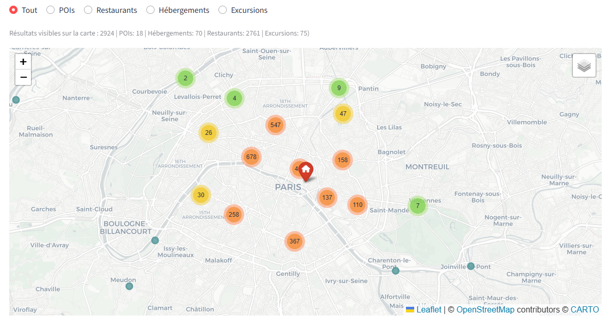
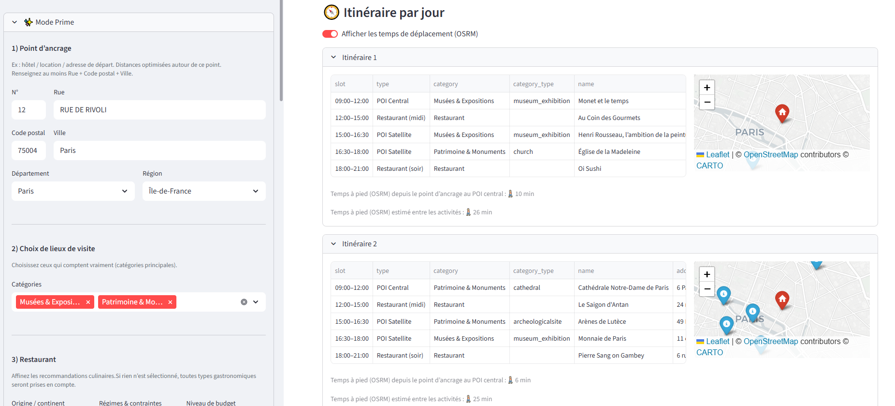
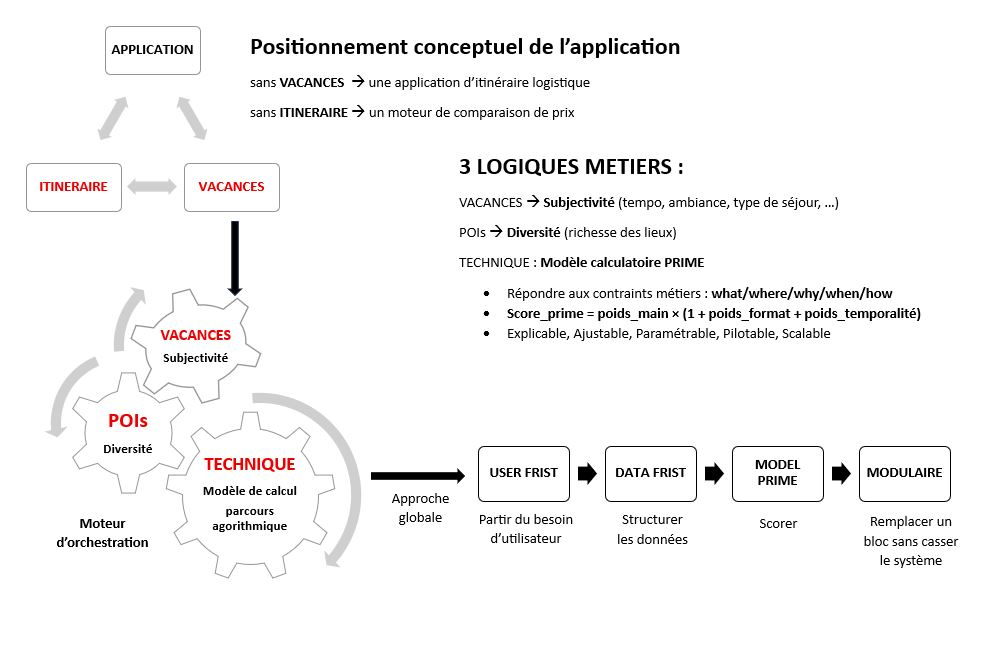
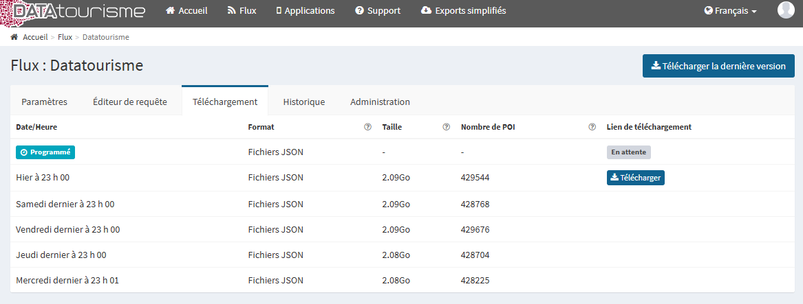
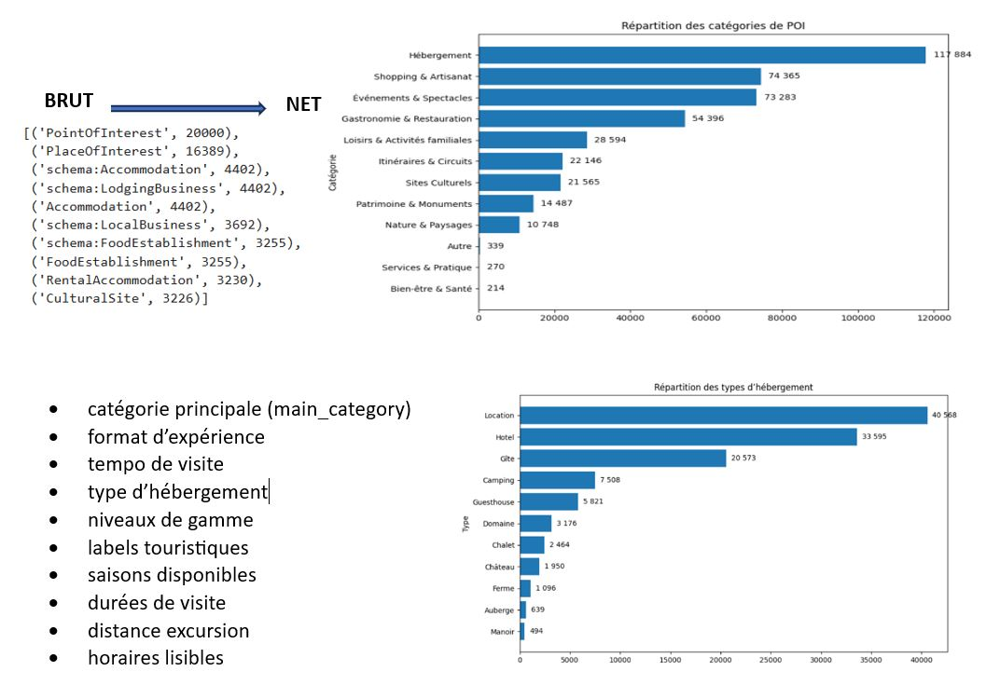
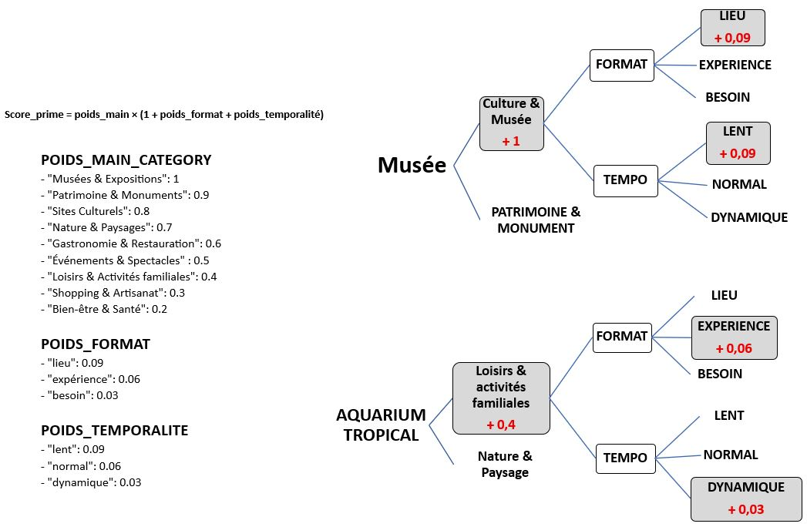
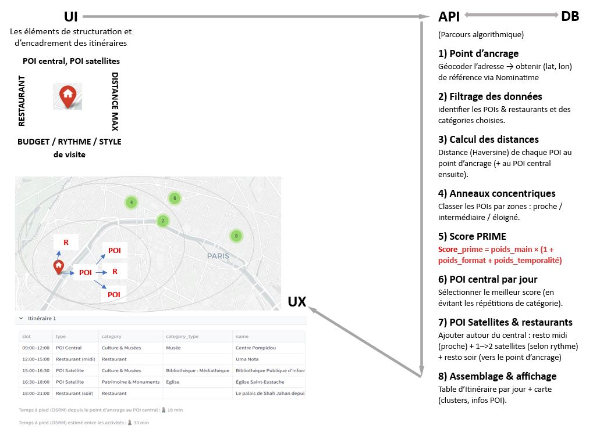
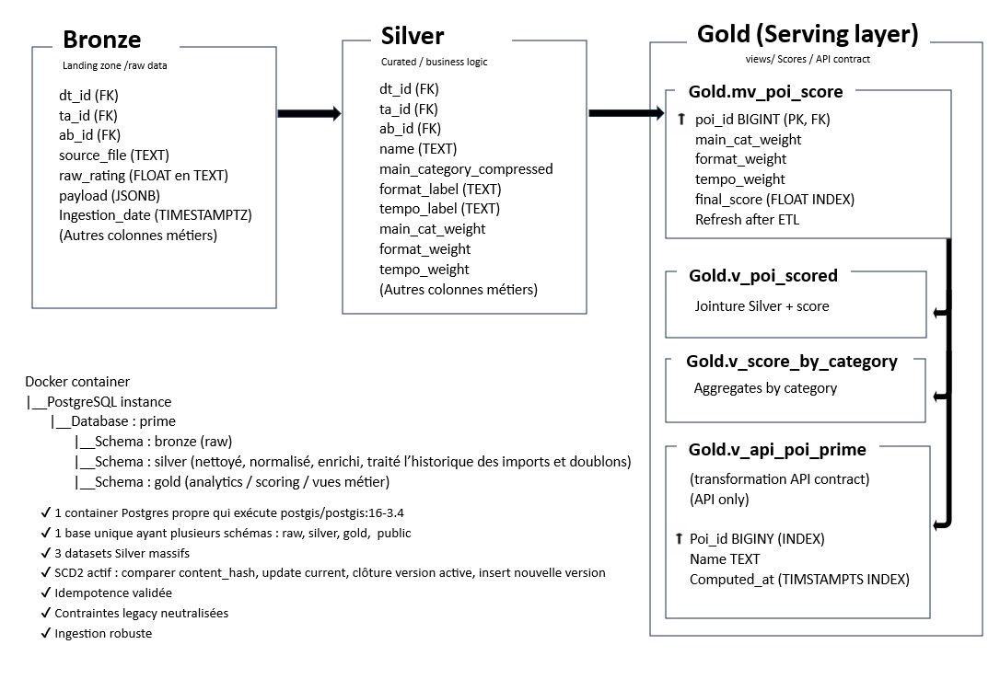
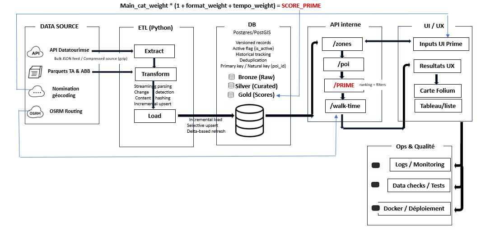
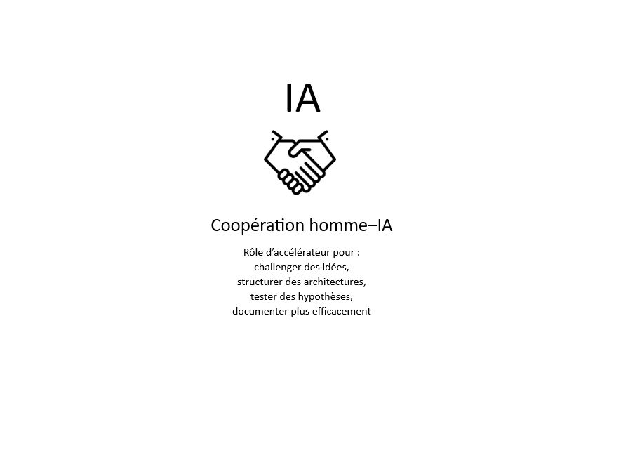

# App d'Itinéraire de Vacances
# (user-first, data-first, orientée produit Prime, modulaire)

**Prime** est un moteur de recommandation d’itinéraires touristiques fondé sur une architecture data modulaire.  
Il combine des données touristiques ouvertes, des signaux analytiques tiers et un modèle de scoring pour proposer des parcours personnalisés (POI principaux, satellites, restaurants midi, soir).

Présentation en format vidéo : https://www.youtube.com/watch?v=cCFvDxpf1a8

---

## 1) Architecture conceptuelle du moteur PRIME

Cette application part d’un principe simple : un voyage n’est ni seulement un trajet, ni seulement une destination.

Un outil de parcours seul devient un calculateur logistique, tandis qu’un outil de séjour seul devient un comparateur d’offres.

L’objectif est donc de réunir déplacement + expérience afin de construire un itinéraire de vacances complet et cohérent.

**Logique métier**

L’application repose sur trois logiques métiers :
- Vacances (subjectivité) : préférences utilisateur — ambiance, rythme, type d’activités
- POIs (diversité) : richesse et variété des lieux proposés
- Modèle PRIME (calcul) : organise et hiérarchise les propositions pour répondre à quoi, où, quand et comment

Le score combine importance du lieu, contexte et temporalité afin de produire des recommandations explicables et ajustables.

**Approche**

L’application suit une démarche progressive :
- Partir du besoin utilisateur
- Structurer les données
- Scorer les options
- Construire l’itinéraire

Son architecture modulaire permet de faire évoluer une partie du système sans casser l’ensemble.

L’objectif n’est pas seulement de recommander des lieux, mais de composer un séjour personnalisé, lisible et cohérent.

---

## 2) Nettoyage & transformation des données

Le flux Datatourisme est composé de milliers de fichiers JSON hétérogènes produits par de multiples acteurs.

La difficulté n’est pas seulement de nettoyer la donnée, mais de la rendre fiable, déterministe et interprétable par un moteur algorithmique.

La transformation convertit donc un flux semi-structuré instable en référentiel touristique normalisé exploitable par l’API et l’U. Car 
- Sans transformation : API proxy de données, UI affichage incohérent, moteur fournie des résultats instables
- Avec transformation : API devient couche métier, UI est une expérience cohérente, moteur a un comportement prédictible

La valeur du projet ne vient pas de la collecte de données, mais de la création d’un référentiel touristique normalisé.

- 1. Validation du flux (Data Contract runtime) pour objectif d'éviter un problème classique, c'est de produire un modèle correct sur des données incorrectes : volume réel de POI, répartition des catégories, validité de la géolocalisation, structure des objets, fraîcheur temporelle
- 2. Normalisation structurelle : Le JSON source n’a pas de schéma strict (dict | list | absent selon les producteurs). La transformation (navigation robuste par chemin, uniformisation list/dict, extraction déterministe) est un passage d’un document fournisseur à une table relationnelle moteur
- 3. Nettoyage métier : corriger des anomalies terrain (suppression coordonnées nulles ou (0,0), filtrage France métropolitaine, déduplication intelligente (fraîcheur + richesse). l'objectif est de ne pas garder plusieurs vérités mais une vérité métier unique.
- 4. Enrichissement sémantique : La donnée descriptive devient une donnée comportementale (le lieu n’est plus seulement stocké, il est interprété)
- 5. Construction du signal algorithmique : produire d’un score homogène indépendant du fournisseur : **score_prime = poids_categorie × (1 + poids_format + poids_tempo)**.

La base devient un dataset décisionnel prêt pour recommandation automatique.
  
Ces notebooks documentent la compréhension des sources et les choix de modélisation.
 
---

## 3) Mécanisme de pondération du modèle PRIME

La sélection des lieux repose sur un modèle déterministe appelé score PRIME.

Son objectif n’est pas de prédire un comportement utilisateur mais de classer les lieux de manière explicable et paramétrable.

Le score combine trois dimensions complémentaires :

1. Importance du lieu (catégorie) : Chaque catégorie possède un poids représentant son rôle dans un séjour. Un lieu structurant (ex : musée) aura plus d’importance qu’une activité secondaire.
2. Format de visite (visite classique (lieu), expérience immersive, besoin ponctuel) décrit la nature de l’interaction qui permet d’éviter un programme monotone.
3. Temporalité (lent, normal, dynamique) adapte les lieux au rythme de la journée et organise la cohérence du parcours plutôt qu’une simple liste de recommandations

Formule : **score_prime = poids_categorie × (1 + poids_format + poids_temporalite)**

Un lieu peut ainsi être valorisé ou pénalisé selon le contexte du séjour. (ex : musée priorisé dans une journée calme, activité dynamique dans un programme court).

Pourquoi ce modèle ? car PRIME est un modèle de décision, pas un modèle de prédiction. Il est :
- interprétable (chaque recommandation est explicable)
- ajustable (paramètres métier modifiables)
- stable (pas de réentraînement ML)

---

## 4) Pipeline algorithmique du moteur PRIME

L’utilisateur fournit un point de référence (ex : logement) ainsi que ses préférences : distance maximale, budget, rythme et types d’activités.

L’API récupère alors uniquement les lieux pertinents depuis la base afin de travailler sur un périmètre utile plutôt que sur l’ensemble des données.

**Étapes de génération**
- Géolocalisation du point de départ
- Calcul des distances entre ce point et chaque lieu
- Classement par zones (proche, intermédiaire, éloigné)
- Évaluation des lieux via le score PRIME
- Sélection d’un lieu central pour la journée
- Ajout de lieux satellites et restaurants adaptés au rythme
- Assemblage de l’itinéraire
- Le résultat est renvoyé sous deux formes :
- carte pour visualiser les déplacements
- liste chronologique pour suivre la journée

L’application construit automatiquement un programme cohérent à partir des préférences utilisateur.

**Limites actuelles**
- dépendance à la qualité des données (horaires, fermetures…)
- journée “type” pas toujours adaptée à chaque profil
- pas encore de prise en compte complète du temps réel (météo, affluence…)

**Évolutions possibles**
- apprentissage progressif des préférences utilisateur
- adaptation en temps réel
- modification interactive de l’itinéraire

L’objectif est d’évoluer d’un outil d’aide à la décision vers un véritable assistant de voyage adaptable.

---

## 5) Industrialisation du pipeline Data

Pour garantir la fiabilité du système, les données ne sont jamais utilisées directement après ingestion.

Elles traversent plusieurs niveaux de transformation afin de devenir cohérentes, comparables et exploitables par le moteur d’itinéraire.

**1. Bronze — données brutes** : archive technique et traçabilité
- Zone d’atterrissage des sources.
- stockage tel que reçu
- conservation de l’historique
- possibilité de retraitement

**2. Silver — données nettoyées** : référentiel métier stable
- Nettoyage et normalisation métier.
- harmonisation des champs
- gestion des doublons
- enrichissement sémantique
- lieux rendus comparables

**3. Gold — données prêtes pour l’application** : couche de service dédiée à la génération d’itinéraires
- Préparation pour l’API et l’UI.
- calcul du score PRIME
- vues métier simplifiées
- accès optimisé pour les requêtes

**Pourquoi cette organisation ?** car le pipeline transforme une collecte hétérogène en base décisionnelle fiable.
- protège les données sources
- sécurise les traitements
- permet d’améliorer une étape sans casser les autres
- rend le système évolutif

## 6) Industrialisation complète & Scalabilité

L’application repose sur une chaîne complète de traitement des données : collecter → préparer → scorer → restituer afin de générer automatiquement un itinéraire personnalisé.

**Sources de données** :

Plusieurs services externes alimentent le système :
- données touristiques (POI)
- restaurants
- géocodage et routage

Ces sources étant hétérogènes, elles doivent être rendues comparables avant toute utilisation.

**Pipeline ETL** :

Les données suivent un processus ETL :
- Extract — récupération des flux
- Transform — nettoyage, normalisation, détection des mises à jour
- Load — chargement incrémental (seules les modifications)

Elles sont ensuite stockées en couches :
- Raw (Bronze) : archive source
- Prepared (Silver) : données nettoyées et enrichies
- Serving (Gold) : données prêtes pour recommandation

**API & moteur**:

- L’API interne interroge la couche Gold pour :
- filtrer les lieux selon les paramètres utilisateur
- calculer le score PRIME
- produire un classement cohérent

**Restitution** :

Les résultats sont envoyés à l’interface sous deux formes :
- carte interactive
- planning de visite

**Supervision** :

Le système intègre :
- logs & monitoring
- contrôles qualité
- déploiement conteneurisé

**Scalabilité & exploitation** :

Dans un contexte de mise en production à grande échelle, l’architecture peut être orchestrée par un planificateur de workflows (ex : Airflow) afin de :
- exécuter les traitements incrémentaux
- gérer les dépendances entre tâches
- rejouer automatiquement un pipeline en cas d’échec

La supervision peut être assurée par une stack d’observabilité (ex : Prometheus + Grafana) pour suivre :
- temps de réponse
- latence des requêtes
- charge système

Le système devient ainsi observable et capable d’anticiper une montée en charge avant impact utilisateur.

L’architecture suit une logique data pipeline orientée décision : la donnée n’est pas seulement stockée, elle est transformée en recommandation exploitable.

---

## 6) IA comme partenaire de développement

---

## Note légale

Ce projet utilise des données issues de sources ouvertes et de sources tierces à des fins d’analyse, de démonstration et de recherche.

- **DataTourisme** est utilisé comme source officielle de points d’intérêt touristiques en open data.
- **TripAdvisor** et **Airbnb** sont utilisés uniquement comme sources analytiques indirectes (signaux agrégés, statistiques, densité), sans redistribution de données propriétaires.

Aucune donnée brute, aucun contenu propriétaire (textes, images, liens, identifiants publics) issu de TripAdvisor ou Airbnb n’est stocké ni exposé à l’utilisateur final.

Ce projet n’est ni affilié, ni soutenu par TripAdvisor ou Airbnb.

---
## Structure du dépôt

